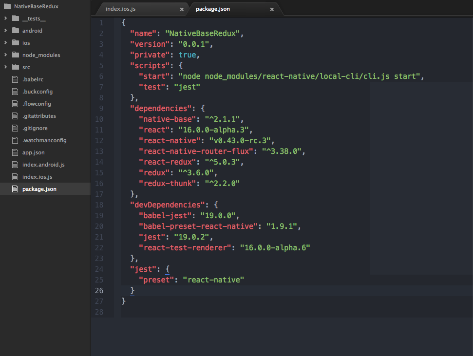
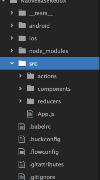

# GitApp Example
GitApp is a sample app made with [React Native](https://github.com/facebook/react-native), [Redux](https://github.com/reactjs/react-redux), and [React Native Router Flux](https://github.com/aksonov/react-native-router-flux) and [NativeBase](https://nativebase.io/) as the main Libraries at work here. 
This is a simple step-by-step tutorial to get familiar with basic concepts of [Redux](https://github.com/reactjs/react-redux)(used for state management), and [React Native Router Flux](https://github.com/aksonov/react-native-router-flux)(used for navigation). This simple App should get you familiar with these Libraries and their use case.  
 
**Find full code [here](https://github.com/GeekyAnts/native-base-example-github-app).**  
 

## Aim

We aim to create an 3 page simple application. It will fetch a list of Top Ten Github Libraries and once the user clicks on any of the items, App will display the information about the item clicked in the next page.

## Installation

**Note:  
If you encounter an issue with [React Native Router Flux](https://github.com/aksonov/react-native-router-flux) during building your project, it might be due to issue with latest versions of [React Native](https://github.com/facebook/react-native). Check out [this issue](https://github.com/aksonov/react-native-router-flux/issues/1761). You might have to bump down the versions of [React Native](https://github.com/facebook/react-native) and React**  

1. **SetUp React Native Project**   SetUp a React Native project. Refer [this](https://facebook.github.io/react-native/docs/getting-started.html) for more information about setting up a React Native project.  
2. **Installing Libraries**   With a React Native project SetUp, We can now install all required Libraries as follows.  
a. **Redux** and **react-redux**  
In your terminal enter the following  
<code>
npm install redux react-redux --save
</code>  
b. **React Native Router Flux**  
Do this
<code>
npm install react-native-router-flux --save
</code>  
c. **NativeBase**  
<code>
npm install native-base --save
</code>  
**Configure all dependencies by running the following command**  
<code>
react-native link
</code>  
By the end of Installation, your package.json file should look something like this. 

## Some Important stuff
Before starting with the development of the App, Let's first create a required folder structure for setting up Redux.  
We first need a **src** folder that resides in the App root location and holds all our logic.  
Inside **src**, we have three folders namely => **actions** , **reducers** , **components** and one file **App.js**. **App.js** is where our App lives mainly. We will import our App from this file. 
We will populate these folders with their respective files as an when we need them.  
The folder structure should look something like this.  

 

## Getting Hands Dirty

Now that we have setup our basic project, Let's get started with some real coding and getting things to work.  

## Setting Up Redux  
If you are unfamiliar with Redux and it concepts, Go through this [Documentation](http://redux.js.org/) and use it as a reference.

#### Redux Store Setup

Back in your <code>index.js</code> file, we will create our **Redux Store**. **Store** is where all data required by our App will live. Also, any data that is required by the App during its execution, is received from the Store.
 
We are going to be optimistic here and import all files we require.(even the ones we have not created yet).  
Go ahead and include all these imports in your index.js file and create the Store as follows. 
If any of this does not make sense now, it will soon enough ;)  
<pre class="line-numbers"><code class="language-jsx">
import allReducers from './src/reducers/index.js';
import App from './src/App.js';
import {createStore} from 'redux';
import {Provider} from 'react-redux';
const store = createStore(allReducers);
</code></pre> 
 
* [Reducers](http://redux.js.org/docs/basics/Reducers.html) can be viewed simply as functions that return some data. All these small pieces of data can be used in App wherever required by importing respective [Reducers](http://redux.js.org/docs/basics/Reducers.html). We will learn more about this soon.  
* An App can have multiple reducers. We are going to use these reducers to form our much required **Store**.
* In the above code, we have assumed that we will have a big combined **allReducers** object having all our Reducers. 
* We have also imported our main **App** component from <code>App.js</code> file.  
* **createStore** function is imported from *redux* module to create a Store(no surprise there).
* A **Provider** component is imported from **react-redux** module. This component will take our **App** component as a child and make our **Store** data available to all parts of our App. It looks something like this.  

<pre class="line-numbers"><code class="language-jsx">
render() { return(
      &lt;Provider store= {store}>
      &lt;App />
      &lt;/Provider>
    );
  }</code></pre> 
* Lastly we create a **Store** to pass to our **Provider** component. We pass allReducers object to create our **Store**.
Our index file should look something like this.

### Redux Reducers
For our purposes, we can have two reducers,
1. A **gitReducer** to return the list of Repos from Github after it has been fetched.
2. A **activeReducer** to return the Repo object that has been selected by the user, otherwise, it must return null.
We can go ahead and create these two files in our reducers folder we had already created.

**gitReducer.js**

<pre class="line-numbers">var gitRepos= [];
export default function(state=gitRepos, action){
  switch (action.type) {
    case "Get_Repos": { gitRepos = action.payload;
      console.log(action, 'action');
      return gitRepos;
    }
      break;
  }
  return gitRepos;
}
</code></pre> 

**activeReducer.js**

<pre class="line-numbers">export default function(state= null, action){
  switch (action.type) {
    case "Repo_Selected": return action.payload;
      break;
  }
  return state;
}
</code></pre> 

It can be observed that reducer functions take in *state* and *action* as arguments. In case an [Action](http://redux.js.org/docs/basics/Actions.html) is dispatched form any point in the App, the action will be sent to all Reducers that we have created. 
The code should make more sense once we are actually using these reducers in our components.
The code above demonstrates the use of actions to manipulate data returned by a [Reducer](http://redux.js.org/docs/basics/Reducers.html).  
More about [Actions](http://redux.js.org/docs/basics/Actions.html) in the coming sections.  

Lastly we need a file to **combine** all our reducers into One Big Javascript object. We create a file inside reducers folder, **index.js**. 
**reducers/index.js**

<pre class="line-numbers">import {combineReducers} from 'redux';
import GitReducer from './gitReducer.js';
import ActiveRepo from './activeReducer.js';
const allReducers= combineReducers({
  repos: GitReducer,
  activeRepo: ActiveRepo
});
export default allReducers;
</code></pre> 

**Note how the combineReducers function takes in all the reducer objects. The names used to initialize Reducers in the combineReducers function will be used to reference that particular Reducer anywhere in our App. More on this later.**

### Redux Actions

We will create ActionCreators which are functions that return action objects with two parameters :-  
1. **type** : Used to identify the type of action we are sending. It is also used to differentiate between multiple actions.  
2. **payload** : Used to hold any data that might be required to accompany the object. (It should become clear in a while).  
For our purposes, we just need two actions  
 **Get_Repos** : To initiate fetch of all Repos from Github API. This action will also change the data returned by our **gitReducer**.  
 **Repo_Selected** : Fired when a particular Repo is selected by the user , it changes the activeReducer to return selected user.

#### Redux Thunk Middleware

**Why is it required?**
The operation of fetching Github Repo list from its API comes under the category of [Async operations](http://redux.js.org/docs/advanced/AsyncActions.html).  
[Async operations](http://redux.js.org/docs/advanced/AsyncActions.html) are where the response to operation does not come instantly, rather is takes some delay time.  
During normal execution of an App, at run time, when an [Async operation](http://redux.js.org/docs/advanced/AsyncActions.html) is encountered, the program flow would have reached ahead when the response from the [Async operation](http://redux.js.org/docs/advanced/AsyncActions.html) is received. This is not desired.  
We need a mechanism to halt program execution until we receive a response of our [Async operation](http://redux.js.org/docs/advanced/AsyncActions.html).  
Thus for our Async fetch operation, we make use of [redux-thunk](https://github.com/gaearon/redux-thunk).

**Installation**
<code>
npm install --save redux-thunk
</code>  

**Setup**
Back in our <code>index.js</code> file where we created our store, we have to make the store aware of the Thunk Middleware. Here is how its done.

**../../index.js**

<pre class="line-numbers">
import thunk from 'redux-thunk'
import {createStore, applyMiddleware} from 'redux';
const store = createStore(allReducers, applyMiddleware(thunk));
</code></pre> 

**Now lets create all our actions including the thunk action.**  

**/action/index.js**
<pre class="line-numbers"><code class="language-jsx">
//Action to get all Repos
export function getRepos(response) {
  return{
    type: 'Get_Repos',
    payload: response
  }
}
// Thunk function, it calls the getRepos action above after it receives the fetch response.
export function getRepoThunk() {
  return function(dispatch, getState) {
    fetch('https://api.github.com/repositories')
    .then(e => e.json())
      .then(function(response){
        console.log(response);
        var arr = response.slice(0,10);
        dispatch(getRepos(arr))
      }).catch((error) => {
           console.error(error,"ERRRRRORRR");
       });
  }
}
// Repo selected action
export function repoSelected(repo){
  return{
    type: 'Repo_Selected',
    payload: repo
  }
}</code></pre> 

**Note how above actions receive arguments to collect data to pass as a payload, we will pass this data while calling any of the Actions **

### Redux components

With all the Redux setup taken care of, we can now create our **Screens** and **Components**. We will be needing three screens.  
We are using [NativeBase](https://nativebase.io/) for the UI Library as it will speed up the process considerably. Lets deal with each of these screens individually.  

### Welcome Screen
This screen will just display some welcome text and includes a button that should navigate to the next screen(note we have not Setup our [RNRF](https://github.com/aksonov/react-native-router-flux) , we will do it after setting up all our screens).

**Code**
<pre class="line-numbers"><code class="language-jsx"><code class="language-jsx">import React, { Component } from 'react';
import { Container, Content, Header, Left, Right, Body, Title, Text, Button, Card, CardItem } from 'native-base';
import { Actions } from 'react-native-router-flux';
 class Welcome extends Component {
    render() {
        return (
            &lt;Container>
                &lt;Header>
                    &lt;Left />
                    &lt;Body>
                        &lt;Title>Welcome&lt;/Title>
                    &lt;/Body>
                    &lt;Right />
                &lt;/Header>
                &lt;Content contentContainerStyle =
                  justifyContent: 'center',
                 alignItems: 'center',
                  paddingTop: 40,
                 paddingHorizontal: 10}}>
                &lt;Card>
                        &lt;CardItem>
                            &lt;Text>
                                Welcome to Candy Land Folks ;)
                            &lt;/Text>
                        &lt;/CardItem>
                        &lt;CardItem>
                            &lt;Text>
                                Press Button to fetch Github Repos
                            &lt;/Text>
                        &lt;/CardItem>
                    &lt;/Card>
                &lt;Button dark block
                onPress= {() =>{ Actions.RepoList();}} style= marginTop: 40}}>
                      &lt;Text> Fetch Github Repos &lt;/Text>
                    &lt;/Button>
                &lt;/Content>
            &lt;/Container>
        );
    }
}
export default Welcome;
</code></pre> 

**Note: We will use [RNRF](https://github.com/aksonov/react-native-router-flux) to navigate between screens, hence in the above code, we import <code>Actions</code> from [RNRF](https://github.com/aksonov/react-native-router-flux) and we have added <code>Actions.RepoList()</code> as an <code>onPress</code> event on the button which will take us to the RepoList Screen.**
The general syntax to navigate between screens in [RNRF](https://github.com/aksonov/react-native-router-flux) goes like :-  
<code>Actions.ACTION_NAME(PARAMS)</code>

### RepoList Screen
This screen will display the List of fetched Repos. We will be needing to use some [Reducers](http://redux.js.org/docs/basics/Reducers.html) data and [Actions](http://redux.js.org/docs/basics/Actions.html).  
### Important stuff  
In order to be able to use Reducers and actions, we need to use two important functions. Both these functions have extremely simple applications(although the names sound scary enough). 
1. <code>mapStateToProps</code> => This function, simply takes your reducer data, that is required, and converts it into a usable [Prop](https://facebook.github.io/react-native/docs/props.html). Now we can use the data as a prop. example <code>this.props.data</code>.  

 **General Syntax of mapStateToProps**  

 <pre class="line-numbers"><code class="language-jsx"><code class="language-jsx">
 function mapStateToProps(state){
  return{
    dataObj : state.reducerName
  };
}
 </code></pre> 

  **Remember how we allotted names to Reducers in the <code>combineReducers</code> function. We use the same name to call respective Reducer**

 2. <code>matchDispatchToProps</code> => This function simply converts our [Actions](http://redux.js.org/docs/basics/Actions.html) into usable props.  
 **General Syntax of matchDispatchToProps**  

 <pre class="line-numbers"><code class="language-jsx"><code class="language-jsx">
 function matchDispatchToProps(dispatch){
  return bindActionCreators({action1: importedAction1, action2: importedAction2}, dispatch)
}
 </code></pre> 
**bindActionCreators function here simply combines our actions into a single object.**  
 Our final code for this screen looks something like this.  
 **/components/RepoList.js**  

 <pre class="line-numbers"><code class="language-jsx"><code class="language-jsx">
 import React, { Component } from 'react';
import { Container, Content, Header, Left, Right, Body, Title, Text, Button, Spinner, List, ListItem, Icon } from 'native-base';
import {connect} from 'react-redux';
import {bindActionCreators} from 'redux';
import { Actions } from 'react-native-router-flux';
import {getRepos, getRepoThunk, repoSelected} from '../actions/index';
class RepoList extends Component{
  componentWillMount(){
    this.props.getRepoThunk();
  }
  render(){
    if(this.props.repos.length === 0){
    return(
      &lt;Container>
      &lt;Header> &lt;Left>
      &lt;Button transparent onPress= {()=>Actions.pop()}>
      &lt;Icon name='arrow-back' />
      &lt;/Button>
      &lt;/Left>
      &lt;Body>
      &lt;Title>Repo List&lt;/Title>
      &lt;/Body>
      &lt;Right />
      &lt;/Header>
      &lt;Content >
      &lt;Text>Loading your repo List, Please wait&lt;/Text>
      &lt;Spinner />
      &lt;/Content>
      &lt;/Container> );}
      else if(this.props.repos.length !== 0){
      return(
      &lt;Container>
      &lt;Header>
      &lt;Left>
      &lt;Button transparent onPress= {()=>Actions.pop()}>
      &lt;Icon name='arrow-back' />
      &lt;/Button>
      &lt;/Left>
      &lt;Body>
      &lt;Title>GitHub Repo List&lt;/Title>
      &lt;/Body>
      &lt;Right />
      &lt;/Header>
      &lt;Content>
      &lt;List dataArray={this.props.repos}
      renderRow={(item) =>
      &lt;ListItem onPress={() => { Actions.RepoInfo();
      this.props.repoSelected(item)}}>
      &lt;Text>{item.full_name}&lt;/Text>
      &lt;/ListItem>}>
      &lt;/List>
      &lt;/Content>
      &lt;/Container>);}
  }}
function mapStateToProps(state){
  return{
    repos : state.repos
  };
}
function matchDispatchToProps(dispatch){
  return bindActionCreators({getRepos: getRepos, getRepoThunk: getRepoThunk, repoSelected: repoSelected}, dispatch)
}
export default connect(mapStateToProps, matchDispatchToProps)(RepoList);
 </code></pre> 

 **Explained**  
 1. We have imported all the required actions and converted both Reducers and Actions into Props as described above.
 2. Inside <code>componentWillMount</code> function, we call <code>getRepoThunk</code> function to initiate the fetch action.
 3. We are listening for changes in the <code>this.props.repos</code> inside render method, to know when the List is fetched. As long as the response is not received, we show a spinner on the screen.
 4. Once List is fetched, the component returns a different Javascript displaying the List.
 5. The back Button present in the <code>Header</code> component will fire a <code>Actions.pop()</code> function of [RNRF](https://github.com/aksonov/react-native-router-flux) to return to the previous screen.
 6. Also on clicking any of the <code>ListItem</code> components, we will fire a Redux action <code>Repo_Selected</code>. Our <code>activeReducer</code> is listening for this action as stated above. Also the click will navigate to <code>RepoInfo</code> page through the RNRF action <code>Actions.RepoInfo()</code>.  
 7. The last line with the connect function takes in both our smart functions => <code>mapStateToProps</code> and <code>matchDispatchToProps</code> and combines it to our dumb component to make it smart and powerful, with access to Actions and Reducer data.

#### RepoInfo Screen

This screen will display the information about the Repo selected by the user. The code looks like this.  

**/components/repoinfo.js**
<pre class="line-numbers"><code class="language-jsx"><code class="language-jsx">
import React, { Component } from 'react';
import { Container, Content, Header, Left, Right, Body, Title, Text, Button, List, ListItem, Icon} from 'native-base';
import {connect} from 'react-redux';
import { Actions } from 'react-native-router-flux';
class RepoInfo extends Component{
  render(){
    return(
      &lt;Container>
          &lt;Header>
              &lt;Left>
              &lt;Button transparent onPress= {()=>Actions.pop()}>
                            &lt;Icon name='arrow-back' />
                        &lt;/Button>
              &lt;/Left>
              &lt;Body>
                  &lt;Title>Repo Info&lt;/Title>
              &lt;/Body>
              &lt;Right />
              &lt;/Header>
              &lt;Content>
              &lt;List>
              &lt;ListItem>&lt;Text>{this.props.activeRepo.full_name}&lt;/Text>&lt;/ListItem>
              &lt;ListItem>&lt;Text>{this.props.activeRepo.description}&lt;/Text>&lt;/ListItem>
              &lt;ListItem>&lt;Text>{this.props.activeRepo.id}&lt;/Text>&lt;/ListItem>
              &lt;ListItem>&lt;Text>{this.props.activeRepo.owner.login}&lt;/Text>&lt;/ListItem>
              &lt;ListItem>&lt;Text>{this.props.activeRepo.url}&lt;/Text>&lt;/ListItem>
              &lt;/List>
              &lt;/Content>
      &lt;/Container>);
  }
}
function mapStateToProps(state){
  return{
    activeRepo : state.activeRepo
  };}
export default connect(mapStateToProps)(RepoInfo);
</code></pre> 

**Explained**  
1. The screen takes reducer data from <code>activeReducer</code>.
2. activeReducer is usable as a [Prop](https://facebook.github.io/react-native/docs/props.html).

## Adding [RNRF](https://github.com/aksonov/react-native-router-flux) and finishing up

Finally in our <code>App.js</code>, we apply our RNRF logic. For Syntax and tutorial refer [this](https://github.com/aksonov/react-native-router-flux/blob/master/docs/MINI_TUTORIAL.md).  

**/src/App.js**

<pre class="line-numbers"><code class="language-jsx"><code class="language-jsx">// RNRF logic here
import React, { Component } from 'react';
import { Router, Scene } from 'react-native-router-flux';
import Welcome from './components/welcome.js';
import RepoList from './components/repolist.js';
import RepoInfo from './components/repoinfo.js';
export default class App extends Component{
  render(){
    return(
      &lt;Router hideNavBar= "true">
        &lt;Scene key="root">
          &lt;Scene key="Welcome" component={Welcome} title="Welcome" initial={true} />
          &lt;Scene key="RepoList" component={RepoList} title="RepoList" />
          &lt;Scene key="RepoInfo" component={RepoInfo} title="RepoInfo" />
        &lt;/Scene>
      &lt;/Router>
    );
  }
}</code></pre> 

Here the <code>key</code> property has been used in our app to provide navigation Actions like: <code>Actions.RepoList</code>  
By now your folder structure should look something like this  
  
With that, we have completed setting up our app, build your project and run. 
